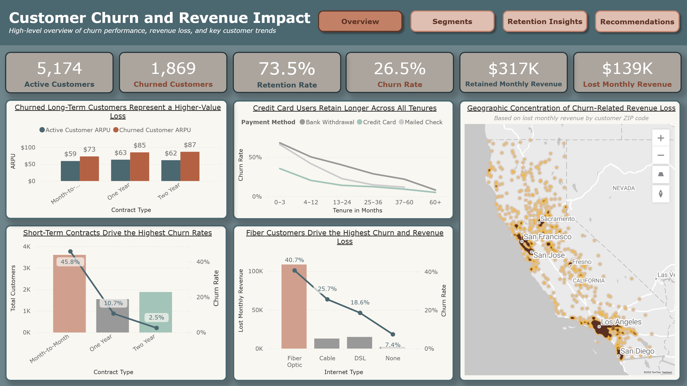
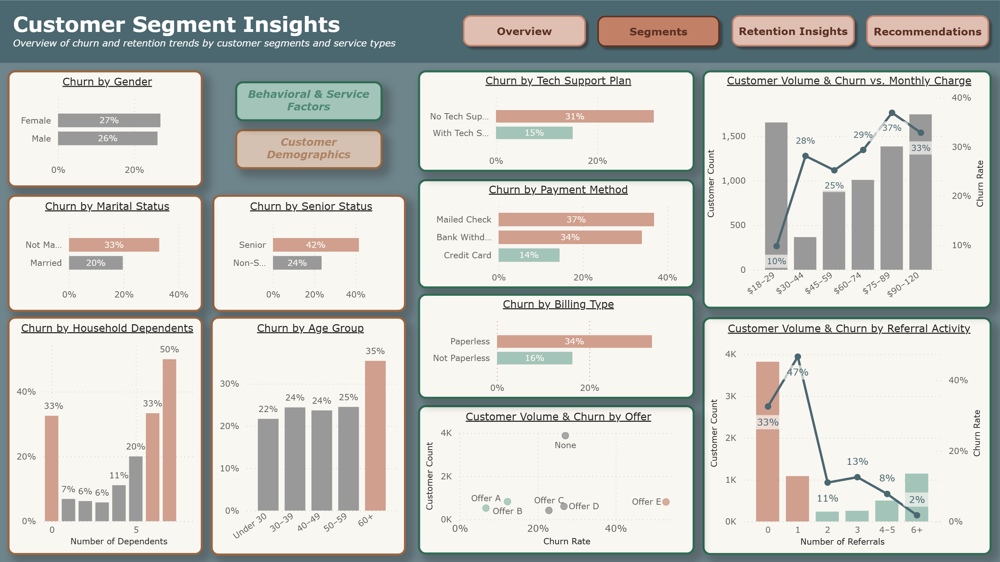
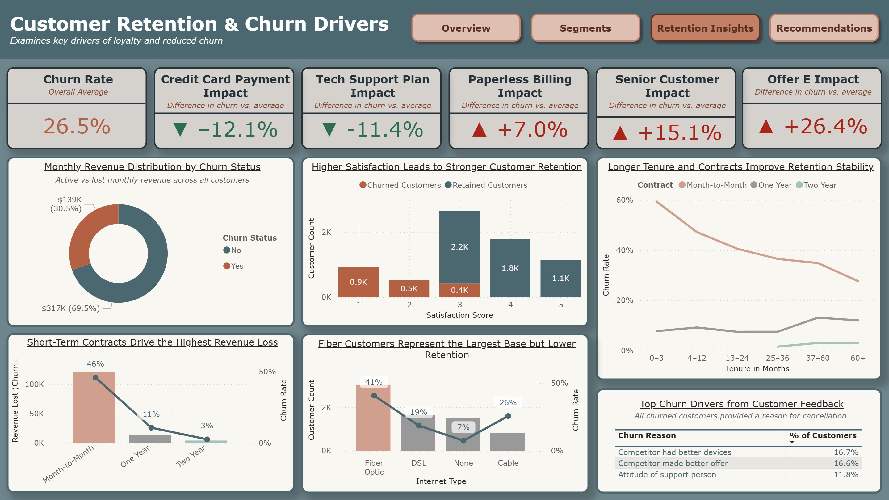
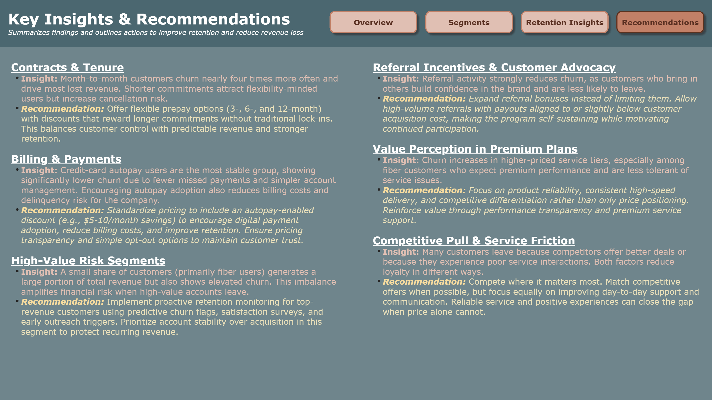

# Reducing Customer Churn for Veridian Networks

  
  

  
  

  

For subscription-based companies, small changes in customer churn can translate into massive revenue swings. This Power BI project explores the drivers of churn at Veridian Networks, a fictional telecom provider offering internet, phone, and bundled services.   

The goal was simple: **understand why customers leave, identify who is at risk, and recommend how to keep them longer.**   

📊 Explore the interactive Power BI file below:

  

   

---

### 📁 Dataset
This analysis is based on the **IBM Cognos Analytics’ [Telecommunications Industry Sample Data](https://accelerator.ca.analytics.ibm.com/bi/?perspective=authoring&pathRef=.public_folders%2FIBM%2BAccelerator%2BCatalog%2FContent%2FDAT00148&id=i9710CF25EF75468D95FFFC7D57D45204&objRef=i9710CF25EF75468D95FFFC7D57D45204&action=run&format=HTML)**, available through the IBM Accelerator Catalog.  

The dataset includes anonymized customer demographics, service details, and churn outcomes, and was designed by IBM to demonstrate telecom analytics and business intelligence use cases.

---

## 🔧 Project Overview

The analysis used a cross-section of over 7,000 customers, combining service data, demographics, payment behavior, and engagement details.

All modeling and visualization were done in **Power BI**, including:
- Power Query for cleaning and modeling  
- DAX measures for churn, ARPU, and revenue impact  
- Interactive dashboards tracking key churn and revenue drivers  

The dashboard was built around four pages:
1. **Overview** – Company-wide churn, revenue, and customer trends  
2. **Customer Segments** – Churn patterns by demographics and behavior  
3. **Retention Drivers** – Key factors and actionable insights  
4. **Recommendations** – Strategic actions for Veridian Networks  

---

## 💡 Key Insights

### 1. Short-Term Contracts Are the Core of Churn
- **Insight:** Month-to-month customers churn almost 4× more than long-term customers, driving the majority of revenue loss.  
- **Interpretation:** Many customers choose flexibility at signup but cancel early when promotions end or competitors advertise better deals.  
- **Recommendation:** Offer flexible prepay plans (3-, 6-, or 12-month) that reward longer commitments without traditional contracts. Incentivize renewal with loyalty credits or bundled perks like tech support.

---

### 2. Early Lifecycle Churn Peaks in the First Year
- **Insight:** Customers within their first 12 months show the steepest churn rates, particularly those without contracts.  
- **Interpretation:** Early attrition suggests onboarding and initial satisfaction are weak points in the customer journey.  
- **Recommendation:** Create a “Welcome Retention Journey” with proactive check-ins at 6 and 12 months and usage-based nudges to help new users see value faster.

---

### 3. Credit-Card Autopay Improves Retention
- **Insight:** Credit-card autopay users churn at less than half the rate of check or bank-withdrawal users.  
- **Interpretation:** Automated billing reduces friction, missed payments, and account closures from manual management.  
- **Recommendation:** Adopt an autopay-based pricing structure where the published rate assumes autopay enrollment. Customers who opt out would pay $5–10 more per month, aligning with industry standards while encouraging digital payments and reducing churn.

---

### 4. Paperless Billing Alone Does Not Increase Retention
- **Insight:** Paperless billing users churn twice as much as non-paperless (34% vs 16%).  
- **Interpretation:** Going digital removes touch points that remind customers of their service, weakening engagement over time.  
- **Recommendation:** Pair paperless billing with reminder emails, payment confirmations, and personalized content to maintain ongoing contact.

---

### 5. Fiber Customers Are the Most Valuable and Most Volatile
- **Insight:** Fiber users generate the highest ARPU ($90+) but churn at 40%, far above DSL, Cable, or phone-only users.  
- **Interpretation:** These customers are more demanding, sensitive to service quality, and targeted by competitors.  
- **Recommendation:** Implement proactive satisfaction monitoring, ticket follow-up workflows, and retention outreach within the first 90 days of service.

---

### 6. Tech Support Subscriptions Cut Churn in Half
- **Insight:** Customers with premium tech support churn 15% vs 31% without it.  
- **Interpretation:** Reliable support builds trust and prevents cancellations triggered by small technical frustrations, especially among seniors.  
- **Recommendation:** Integrate essential tech support into all plans, or at minimum include it for senior or high-risk segments. The small support cost would likely be offset by reduced churn and stronger customer satisfaction.

---

### 7. Offer E Is Driving Short-Term Acquisition but Long-Term Loss
- **Insight:** Customers on Offer E churn at 53%, nearly double the company average, while Offers A and B show far stronger retention.  
- **Interpretation:** Offer E likely attracts price-sensitive, promotion-driven customers who cancel once introductory benefits end.  
- **Recommendation:** Audit the purpose and structure of Offer E. If it functions as an acquisition promo, redesign it with retention-linked incentives (e.g., discounts that unlock after renewal). Shift marketing emphasis toward Offers A and B until Offer E’s long-term impact is validated.

---

### 8. Married and Mid-Sized Families Are the Most Stable
- **Insight:** Married customers churn 40% less than singles, and families with 1–4 dependents churn the least.  
- **Interpretation:** Multi-person households rely more on stable service and show stronger brand inertia.  
- **Recommendation:** Market bundled family plans and shared loyalty programs to replicate “household stickiness” across single customers.

---

### 9. Older Customers Show the Highest Churn Risk
- **Insight:** Churn rises sharply among older customers—35% for ages 60+, and over 40% among those flagged as “Seniors.”  
- **Interpretation:** Older users face more digital barriers, such as difficulty managing paperless billing or online support.  
- **Recommendation:** Launch a “Senior Assist” program offering simplified billing, optional mailed statements, and a dedicated phone line for support.

---

### 10. Referrals Create Momentum That Drives Retention
- **Insight:** Churn drops sharply as customers begin referring others, from 47% after 1 referral to 11% after 2 or more.  
- **Interpretation:** The benefit is not about reaching a specific number of referrals but about building ongoing engagement. Once customers start referring consistently, they see themselves as part of the brand community and become far less likely to leave.  
- **Recommendation:** Design referral programs that reward continued participation, not just one-time actions. Use compounding incentives to sustain momentum and create a feedback loop where retention and acquisition reinforce each other.

---

### 11. Price Sensitivity and Competitor Pull Are Interconnected
- **Insight:** Churn rises from 10% to 37% as monthly charges increase, and exit surveys cite better competitor offers as the top reason for leaving.  
- **Interpretation:** Higher costs make customers more likely to compare alternatives, and competitors often win by framing their offers as better value for the price.  
- **Recommendation:** Improve value perception through clearer communication, reliable service guarantees, and bundled benefits. Emphasize what differentiates the service beyond price to reduce the appeal of competitor discounts.

---

## 💰 Business Opportunity

This section estimates the financial impact of reducing churn by modeling how many customers Veridian could retain, how much recurring revenue that represents, and what the long-term business value of those improvements would be.

From the model, Veridian has **5,174 active customers** and **1,869 churned customers**, for a total of 7,043 and a churn rate of **26.5%**.  
Active ARPU is **$61.27** per month and churned ARPU is **$74.44** per month. Using the churned ARPU to value revenue at risk, the annualized loss from churn is:

`1,869 × $74.44 × 12 = ≈ $1.67 million ARR`

If Veridian reduces churn by **20–25%**, that retains roughly **374–467 customers**. At $74.44 per month each, that equates to **$334,000–$417,000 in ARR recovered** in the first year.

Assuming an average customer lifespan of **3.5 years**, this compounds to **$1.17–$1.46 million in retained revenue** over a typical customer lifetime.  
Considering secondary benefits such as lower reacquisition costs and moderate upselling, the total business impact aligns around **$2.5–$3.0 million in retained value**.  
This aligns with Bain & Company’s findings that each 1% reduction in customer churn increases company valuation by 4–5% (*Bain & Company, Customer Retention Economics*).

**In summary:** Reducing churn among high-value and short-term customers could recover several million dollars in long-term revenue while improving overall stability and brand loyalty.

---

## 🧭 Project Takeaways

This project illustrates how integrated customer data can uncover both the financial and behavioral drivers of churn.  
Through Power BI’s modeling and visualization tools, the analysis moves from static reporting to **data-driven strategy**, showing where Veridian’s retention efforts can deliver the highest return.

---
